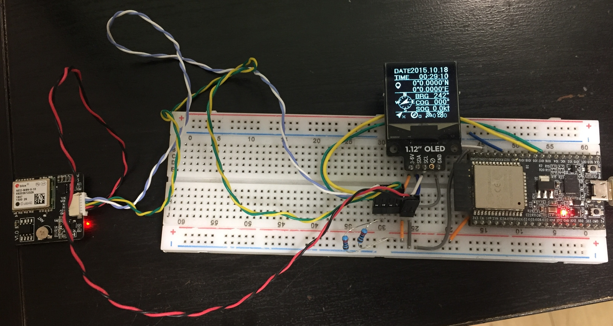

# NMEA-UDP-Sender

I made this as an "Add on wireless GPS module" for tablet devices such as Amazon fire that has no GPS.
With this wireless GPS and plotting apps like [OpenCPN](https://bigdumboat.com/aocpn/cpnapp.html), you can use the tablet as a portable chart plotter!

* It polls positioning data from Ublox GPS module with UBX protocol via UART (or I2C with some codes mod).
* Positioning data is converted to NMEA0183 format char buffer including checksum.
* It sets ESP32 as an Wifi access point, and unicast the NMEA sentence to client.
* Plotter app (or any other app that uses positioning data) should get NMEA0183 sentence via UDP port 2947 (default for gpsd; but you can change it).
 
# DEMO
 

 
# Features
 
Using UBX protocol has advantages below.

* Fast transmission in light data stream.
* You can control polling timing as you like.
* You can configure GPS module without U-Center software. -> Convenient for Mac user! 

It polls position data 10 times per second and casts to the air.
 
# Requirement
 
## Hardware: 
* [ESP32 dev module](https://www.espressif.com/en/products/hardware/esp32-devkitc/overview)
    You can use other ESP32 module like M5stack ....
* Ublox GPS module: [M8N, M8Q, ...](https://www.u-blox.com/product/neo-m8-series)
    It's easy for wiring connection that you use [such like this module](https://ja.aliexpress.com/item/32808231236.html?spm=a2g0s.9042311.0.0.27424c4d4MlPBa) instead of just a chip above.
 
## Library:
* [Sparkfun Ublox Arduino Library](https://github.com/sparkfun/SparkFun_Ublox_Arduino_Library)
    It makes easy to treat UBX protocol. Great library!

# Installation
 
## Hardware:
  
 Connect as follows
 * GPS TX to ESP32 UART1 RX (IO16 on Espressif ESP32 devkitC) Green line in photo
 * GPS RX to ESP32 UART1 TX (IO17 on Espressif ESP32 devkitC) Yellow line in photo
 * GPS VCC to ESP32 3.3V ("3V3" on Espressif ESP32 devkitC) Red to Orange line in photo
 * GPS GND to ESP32 GND Black to gray line in photo
 
## Software:
 This code is developed on Visual Studio Code 1.38.0 with PlatformIO IDE 1.8.3 running on OSX 10.13.6.
 In this circumstance, you should install some extensions below to PlatformIO.
 * Espressif 32 platform
 * Sparkfun Ublox Arduino Library
 
 In case you use Arduino IDE, or Visual Studio Code with Arduino extension, you should comment out the line below, 
 and change the file name extension from .cpp to .ino.

```bash
// #include <Arduino.h>
```

# Usage
 
1. Power the ESP32 module outside, immediately it starts access point (192.168.20.1) and sending NMEA sentence on UDP.
1. Open Wifi configuration on your smartphone or tablet, and find "ESP32" and connect it. Your phone IP may be 192.168.20.2.
2. To check the NMEA0183 data flow, use some UDP client app, bind UDP port 2947.
   1. GPS module warms up (grabs satellites data and calc self position) in 30 secs for the first time.
   2. When GPS module fixed precise position, you can see "A" character instead of "V" in NMEA0183 sentence.
```bash
$GNRMC,165939.900,A,35@@.29033,N,139@@.52259,E,56.59,199.06,070919,,,A*48
$GNGLL,35@@.29033,N,139@@.52259,E,165939.90,A*1C
$GNRMC,165940.100,A,35@@.28830,N,139@@.52089,E,56.57,199.08,070919,,,A*4B
$GNGLL,35@@.28830,N,139@@.52089,E,165940.10,A*1F
$GNRMC,165940.300,A,35@@.28588,N,139@@.51975,E,56.58,199.07,070919,,,A*4E
$GNGLL,35@@.28588,N,139@@.51975,E,165940.30,A*1A
```
At this moment, it sends RMC and GLL sentences. *'@@' is masked to protect my privacy ;)
1. Only one client can bind to the specific port. So close the client app before making OpenCPN to connect.
* Refer to [OpenCPN docs](https://opencpn.org/wiki/dokuwiki/doku.php?id=opencpn:opencpn_user_manual:options_setting:connections) for configuration of connecting external NMEA0183 data flow in OpenCPN.

 
# Note
 
I wanted to broadcast NMEA0183 instead of unicast for multi devices connection. But UDP data flow is terribly stacked in broadcast.
I struggled to fix it for days but I couldn't. Welcome your suggestions if you can fix it!
I will add new function below.
* Add GGA sentence ... Done!
* Add HDM sentence with mag compass output ... Done!
* OLED display output
* Seatalk - NMEA0183 bi-directional communication
* small issue: When reconnects Wifi after once disconnected,  SoftAP atatches new IP, so UDP connection is lost. 

# Author
 
[mayopan](https://github.com/mayopan)
 
# License
 
"NMEA-UDP-Sender" is under [MIT license](https://en.wikipedia.org/wiki/MIT_License).